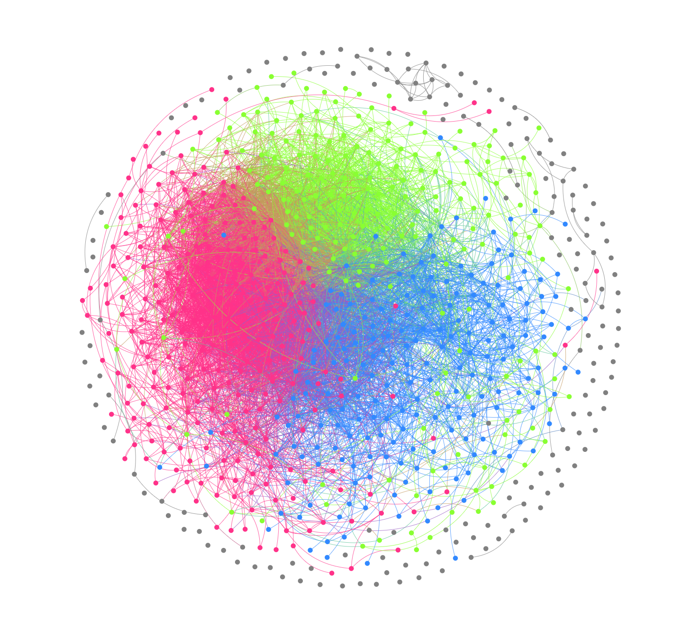
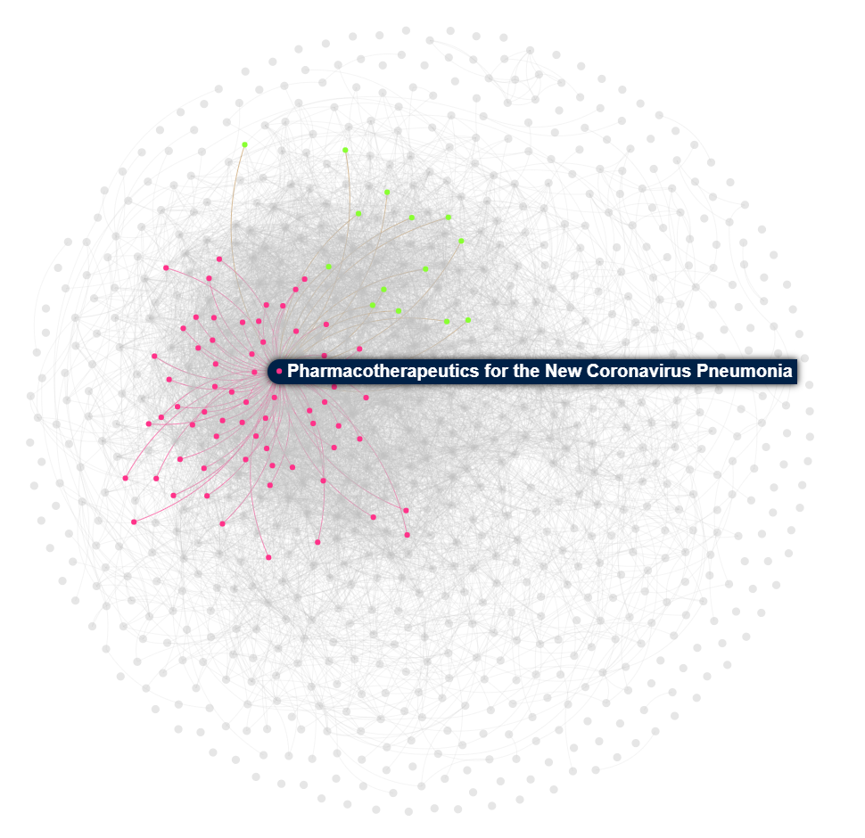

# Browser-19
Repository for the hackathon Lauzhack Against COVID-19. https://devpost.com/software/web-browser-for-scientific-coronavirus-paper

This project aims to provide a visual aid to browse through the papers related to the different coronaviruses. We used NLP tools to cluster scientific papers within a topic and a subtopic, and then we built a graph network of the papers in its subtopic.

The graph visualisation allows the user to quickly get a grasp of the existing papers in a selected field of research and encourages the user to navigate to related papers.
Moreover, a search engine is proposed to browse for a specific subject and it can redirect to the location of the paper within the graph.

Our search engine is not completely linked to our visualization tool yet.

### Search engine repository:
The code that we made for the search engine is in another repo: https://github.com/TinaRey/covid-19 (forked)

Note that it is only a front end that does not do an actual search, but the connection with the back end is almost done.

The back end connection with the front end has not been maintained.

### Visualization:
Topic/Subtopic selection, graph visualizations: https://valerianrey.github.io/Covid19_Papers_V2/

Search engine: https://onefork.github.io/covid-19/

### Dataset: 
https://www.kaggle.com/allen-institute-for-ai/CORD-19-research-challenge

### Original console browser: 
https://github.com/gsarti/covid-papers-browser

We used the idea of the search engine and some of their code (located in the scripts folder) that produces text embeddings from the abstracts of the papers.

Disclaimer: some of the work was already done before the start of the Lauzhack hackathon (this project started a week before for the *CodeVsCovid19* hackathon).
### NLP
Language inference using a pretrained fasttext model on the papers abstracts.

Preprocessing and Latent Dirichlet Allocation to find the topics. 

Use of pyLDAvis for topics clustering visualization (measures the intertopic distance).

